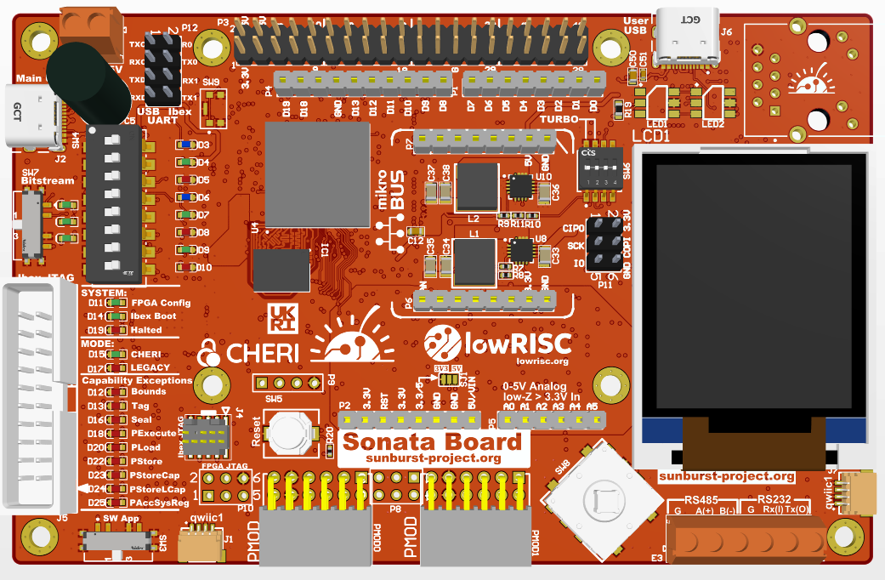

# Sonata PCB Sources for Development Board

Sonata is a system for evaluating the usage of [CHERIoT Ibex core](https://github.com/microsoft/cheriot-ibex) as a microcontroller for embedded, IoT and Operational Technology applications.
See the main [Sonata System](https://github.com/lowRISC/sonata-system) repository for more information.

This repository contains the source files for the PCB and related information about the development board.

Sonata is part of the [Sunburst Project](https://www.sunburst-project.org) funded by [UKRI](https://www.ukri.org/) / [DSbD](https://www.dsbd.tech/).

## Associated Repos for Testing

See the [https://github.com/newaetech/sonata-rp2040](https://github.com/newaetech/sonata-rp2040) repo for the RP2040 firmware.

See the [https://github.com/newaetech/sonata-fpga-test](https://github.com/newaetech/sonata-fpga-test) repo for the FPGA test bitstream project, which is used only for testing certain features, or can be used as the base for your own FPGA project. Most users should see the [Sonata System](https://github.com/lowRISC/sonata-system) repository instead to build the reference Sonata FPGA.

## License

Unless otherwise noted, everything in the repository is covered by the [Apache License](https://www.apache.org/licenses/LICENSE-2.0.html), Version 2.0. Where reference is made to the CC-SA license (particular for the PCB files), the license is the [Creative Commons Share Alike 4.0 License](https://creativecommons.org/licenses/by-sa/4.0/).

## PCB Status

Rev0.8 Gerbers are available & is the first production version. There will be some minor tweaks for the final version, but boards made from 0.8 gerbers will be fully functional.
