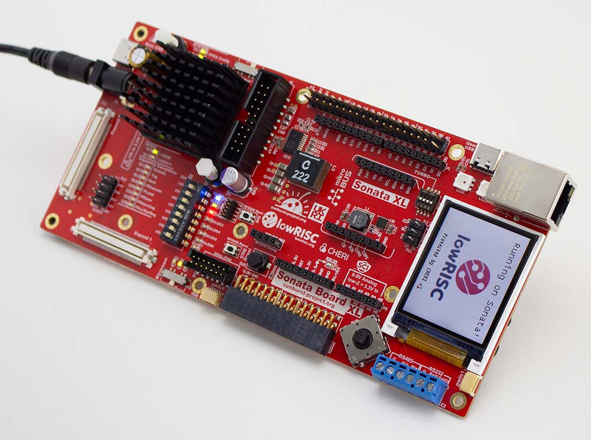

# SonataXL

SonataXL has a larger A200 FPGA, as well as 2x high density pin headers for various expansion boards.

It uses the same drag & drop RP2040 firmware as the Sonata board. The only difference in peripherals is there
is no HyperRAM on this board.